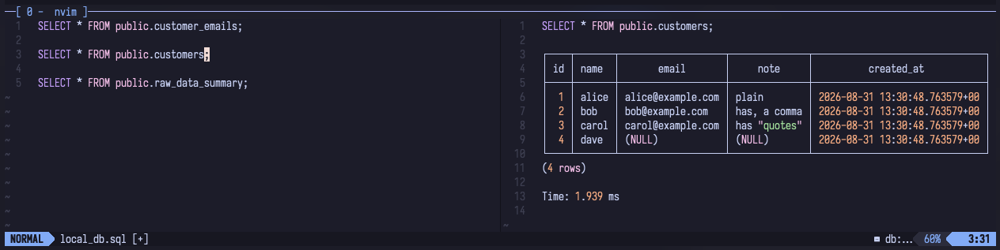
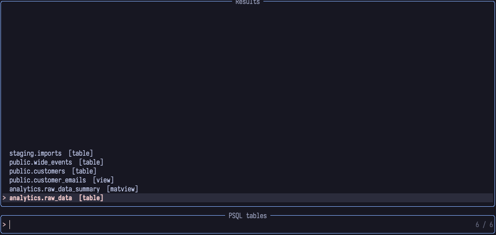
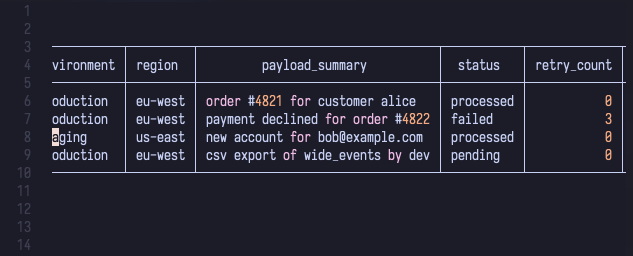
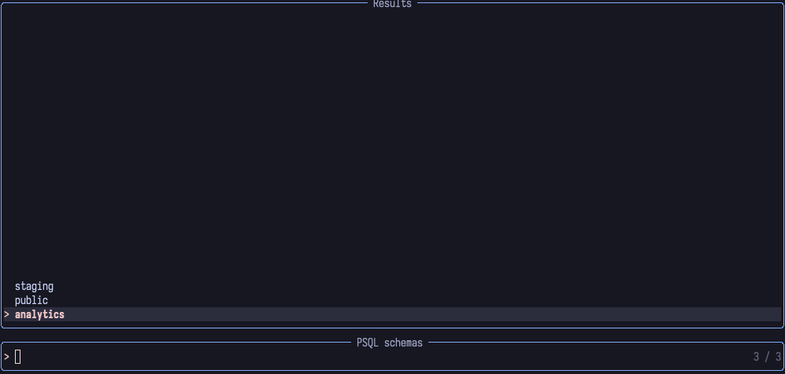
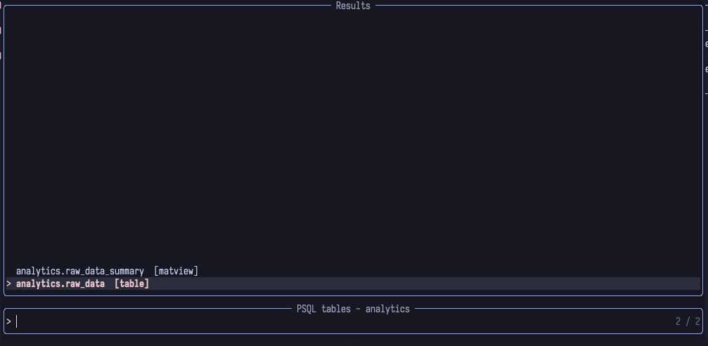
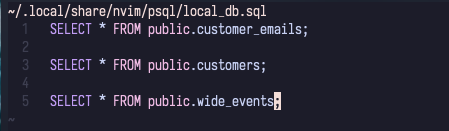
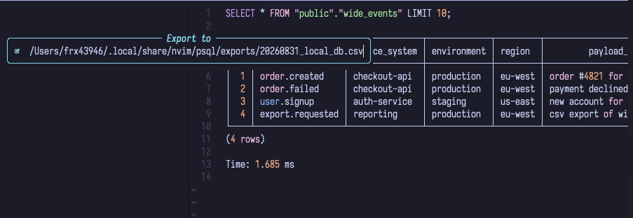
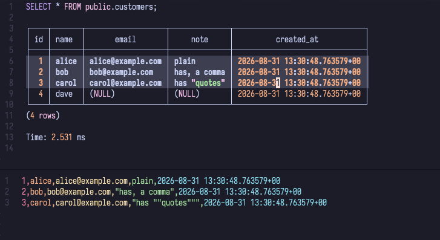

# psql.nvim

Query PostgreSQL from Neovim without leaving your editor, without blocking it,
and without putting a password in your config.

<!--
SCREENSHOT docs/media/hero.png
Shows: the whole loop in one frame.
Setup: a vertical split. Left, a .sql file with two or three statements, cursor
  inside a SELECT. Right, the __SQL__ buffer showing that query echoed, a
  "Time: N ms" line, and a result table of 4-5 rows.
Framing: full Neovim window, no terminal chrome, no tab bar clutter.
-->


```lua
require("psql").setup({
	connections = {
		local_db = { host = "localhost", port = 5432, database = "postgres", username = "dev" },
	},
	default = "local_db",
})
```

---

## Lineage

This is a fork of [harrisoncramer/psql](https://github.com/harrisoncramer/psql),
itself forked from [mzarnitsa/psql](https://github.com/mzarnitsa/psql). Those
projects contributed the core idea this one still rests on: write SQL in a normal
buffer, read the result in another one, no modal UI in between.

Everything under that idea has been rewritten. Execution moved off the main
thread, authentication moved to `~/.pgpass`, the schema became browsable, and the
plugin gained a test suite. If you are coming from either upstream, read
[Migrating](#migrating-from-an-upstream-version) — the configuration format
changed.

## What you get

| | upstream | psql.nvim |
|---|---|---|
| Execution | `vim.fn.systemlist`, editor frozen until the query returns | `vim.system`, asynchronous and cancellable |
| Authentication | password or hash stored in your Neovim config | `~/.pgpass`, resolved by `psql` itself |
| Switching database | one Lua file per connection, hand-written | Telescope picker over declared connections |
| Schema browsing | none | connections, databases, schemas, tables |
| Ad-hoc queries | scratch buffer, lost on exit | a real `.sql` file per connection |
| Getting data out | one cell at a time | CSV to file, or CSV from a visual selection |
| Result buffer | soft-wrapped, editable | horizontal scroll, read-only |
| Lua namespace | `lua/psql.lua`, `lua/util/`, `lua/hash/` | everything under `lua/psql/` |
| Tests | none | 95 cases on `mini.test`, `make test` |

### It never blocks

Queries run through `vim.system`. The editor stays responsive while one is in
flight, and `:PSQLCancel` kills it. A generation counter invalidates results that
belong to a connection you have already left, so a slow answer can never
overwrite a fresh one.

### It never asks for a password

There is no `password` field to fill in, no hash, and no `PGPASSWORD` in your
process list. `psql` is always invoked with `-w` and resolves credentials from
`~/.pgpass`, which is the mechanism PostgreSQL already ships for this.

### It knows your schema

<!--
SCREENSHOT docs/media/picker-tables.png
Shows: :PSQLTables over a real database.
Setup: run :PSQLTables on a schema with a mix of object kinds. Type 2-3
  characters in the prompt so fuzzy matching is visibly at work. The result list
  must contain at least one [table] and one [view] so the kind annotation reads
  clearly.
Framing: the Telescope window, with enough of the underlying SQL buffer visible
  to show it floats over your work.
-->


Four pickers, and a drill-down from schemas into their tables. Selecting a table
previews it immediately.

---

## Requirements

- Neovim **0.10+** — the plugin uses `vim.system`, `vim.fn.getregion` and
  `vim.fs.joinpath`
- `psql` on your `PATH`
- [telescope.nvim](https://github.com/nvim-telescope/telescope.nvim) — **optional**;
  every picker degrades to a clear message without it, and queries work fine

## Installation

<details open>
<summary><b>lazy.nvim</b></summary>

```lua
{
	"edjubert/psql.nvim",
	dependencies = { "nvim-telescope/telescope.nvim" },
	config = function()
		require("psql").setup({
			connections = {
				local_db = { host = "localhost", port = 5432, database = "postgres", username = "dev" },
				staging = { host = "db.example.com", port = 5432, database = "app", username = "readonly" },
			},
			default = "local_db",
		})
	end,
}
```
</details>

<details>
<summary><b>packer.nvim</b></summary>

```lua
use({
	"edjubert/psql.nvim",
	requires = { "nvim-telescope/telescope.nvim" },
	config = function()
		require("psql").setup({ --[[ ... ]] })
	end,
})
```
</details>

To get the pickers under `:Telescope`, load the extension:

```lua
require("telescope").load_extension("psql")
-- :Telescope psql tables
```

## Quick start

1. Declare a connection in `setup()` — four fields, no password.
2. Add a line for it to `~/.pgpass`, then `chmod 600 ~/.pgpass`.
3. Open a `.sql` file, put the cursor in a statement, and run
   `:lua require("psql").query_paragraph()`.

If a password prompt appears, `~/.pgpass` is being ignored — see
[Troubleshooting](#troubleshooting).

## Configuration

```lua
require("psql").setup({
	connections = {
		local_db = { host = "localhost", port = 5432, database = "postgres", username = "dev" },
	},
	default = "local_db",
	connect_timeout = 5,
	query_timeout = 30000,
	preview_limit = 10,
	csv_delimiter = ",",
	export_dir = vim.fs.joinpath(vim.fn.stdpath("data"), "psql", "exports"),
	results_split = "horizontal",
})
```

| Option | Default | Meaning |
|---|---|---|
| `connections` | `{}` | Named connections. Each has exactly `host`, `port`, `database`, `username`. |
| `default` | `nil` | Connection selected at startup. Falls back to any declared one. |
| `connect_timeout` | `5` | `PGCONNECT_TIMEOUT`, in seconds. |
| `query_timeout` | `30000` | Kills a runaway query, in milliseconds. |
| `preview_limit` | `10` | `LIMIT` used when previewing a table from the picker. |
| `csv_delimiter` | `","` | Column separator, for both CSV export and CSV yank. |
| `export_dir` | `<stdpath("data")>/psql/exports` | Where `:PSQLExportCSV` suggests writing. |
| `results_split` | `"horizontal"` | `"horizontal"` or `"vertical"`: which split opens `__SQL__` in. Only applies the first time the window is created; combine with `vim.opt.splitright = true` for a right-hand split. |

There is deliberately **no** `password` field.

## Authentication

`psql` resolves passwords from `~/.pgpass`. The plugin passes `-w`, so it never
prompts and never leaks a password into the process list.

```
# ~/.pgpass — hostname:port:database:username:password
db.example.com:5432:*:readonly:secret
localhost:5432:*:dev:secret
```

The file **must** be `chmod 600`:

```bash
chmod 600 ~/.pgpass
```

PostgreSQL silently ignores a `.pgpass` with looser permissions. The symptom is an
unexpected password prompt, and it is the single most common setup mistake.

## Commands

| Command | Description |
|---|---|
| `:PSQLConnections` | pick a connection |
| `:PSQLDatabases` | pick a database on the current server |
| `:PSQLSchemas` | pick a schema, then drill into its tables |
| `:PSQLTables` | pick any table, as a flat `schema.table` list |
| `:PSQLTemp` | open the scratchpad of the current connection |
| `:PSQLExportCSV` | export a query result to a CSV file — accepts a range |
| `:PSQLCancel` | cancel the running query |
| `:PSQLInfo` | show the current connection and database |

## Lua API

The plugin defines no keymaps. These are the functions worth binding:

| Function | Description |
|---|---|
| `query(sql)` | run an arbitrary string |
| `query_paragraph()` | run the block around the cursor, delimited by blank lines |
| `query_current_line()` | run the line under the cursor |
| `query_selection()` | run the visual selection, in any visual mode |
| `yank_cell()` | copy the result cell under the cursor |
| `yank_csv()` | copy the selected result cells as CSV |
| `export_csv(opts)` | the function behind `:PSQLExportCSV` |
| `last_query()` | the last query handed to `query()`, or `nil` |

## Keymaps

```lua
local psql = require("psql")
local opts = { noremap = true, silent = true, nowait = true }

vim.keymap.set("n", "<localleader>r", psql.query_paragraph, opts)
vim.keymap.set("v", "<localleader>r", psql.query_selection, opts)
vim.keymap.set("n", "<localleader>e", psql.query_current_line, opts)
vim.keymap.set("v", "<localleader>e", psql.query_selection, opts)
vim.keymap.set("n", "<localleader>y", psql.yank_cell, opts)
vim.keymap.set("v", "<localleader>y", psql.yank_csv, opts)
```

Bind every key in **both** normal and visual mode, even where one of the two looks
redundant. An unmapped `<localleader>` prefix falls through in visual mode, and the
next key is then read as a plain Vim command: with `<localleader>r` left unmapped,
pressing it over a selection runs `r`, which silently replaces every selected
character. Mapping it closes that trap.

| | normal mode | visual mode |
|---|---|---|
| `<localleader>r` | run the paragraph | run the selection |
| `<localleader>e` | run the current line | run the selection |
| `<localleader>y` | yank the cell under the cursor | yank the selection as CSV |

---

## Running queries

Three ways to send SQL, none of which need a precise selection:

- **`query_paragraph()`** — the block of lines around the cursor, bounded by blank
  lines. This is the one you will reach for. Separate your statements with a blank
  line and you never have to select anything.
- **`query_current_line()`** — just the line under the cursor.
- **`query_selection()`** — whatever is selected, in any visual mode.

While a query runs, the result buffer shows a `# Running...` placeholder, and
`:PSQLCancel` kills the process.

## Results buffer

<!--
SCREENSHOT docs/media/results.png
Shows: why disabling wrap matters.
Setup: run a query returning a table too wide for the window — 8+ columns, or a
  column holding a long text value. Scroll right with zL so the table is visibly
  cut off on the left edge, proving rows stay on a single line.
Framing: the __SQL__ window filling most of the screen, line numbers visible so
  it is obvious that one row is one line.
-->


Results land in a reused `__SQL__` buffer, which keeps previous queries in view as
a working history.

Wrapping is off, so wide tables scroll horizontally (`zl` / `zh`, `zL` / `zH` for
bigger jumps) instead of folding into unreadable blocks. The buffer is also
**read-only**: it is rendered by the plugin, and hand edits would only desync it
from what `psql` returned.

On failure, `stderr` is rendered in place of the result, so a syntax error reads
exactly where you expect the table.

## Pickers

<!--
SCREENSHOT docs/media/picker-schemas_1.png + docs/media/picker-schemas_2.png
Shows: the drill-down. Frame 1, :PSQLSchemas with a schema highlighted.
  Frame 2, the table picker that opens after selecting it, titled
  "PSQL tables - <schema>".
-->
<table>
<tr>
<td width="50%"></td>
<td width="50%"></td>
</tr>
</table>

- **`:PSQLConnections`** — switch between the connections you declared.
- **`:PSQLDatabases`** — every database on the current server. Selecting one keeps
  the same host, port and user, and swaps only the database.
- **`:PSQLSchemas`** — pick a schema, then land in its tables. `<BS>` goes back to
  the schema list; it is bound in **normal mode only**, so backspace still edits
  the prompt.
- **`:PSQLTables`** — every table, as a flat `schema.table` list, annotated with
  its kind: `table`, `view`, `matview`, `partitioned`.

Selecting a table runs `SELECT * FROM "schema"."table" LIMIT 10;`, with the limit
taken from `preview_limit`. Identifiers are quoted, so mixed-case names and
reserved words survive.

Introspection runs on its own execution slot, which means opening a picker never
cancels a query you are waiting on.

## Scratchpad

<!--
SCREENSHOT docs/media/scratchpad.png
Shows: that the scratchpad is a real file.
Setup: run :PSQLTemp, write two queries in it, and make the statusline or winbar
  visible so the full path
  ~/.local/share/nvim/psql/<connection>.sql can be read. SQL syntax highlighting
  must be visible.
Framing: include the statusline; the path is the point of the shot.
-->


`:PSQLTemp` opens `<stdpath("data")>/psql/<connection>.sql` — a real file on disk,
not a throwaway buffer. Your SQL LSP, your formatter and persistent undo all work
normally, and the file survives restarts.

Each connection gets its own, so your working queries follow the database you are
working on.

## CSV export

<!--
SCREENSHOT docs/media/export-prompt.png
Shows: the destination prompt and its generated suggestion.
Setup: run :PSQLExportCSV from the __SQL__ buffer. Capture while the prompt is
  open, pre-filled with a path of the form
  ~/.local/share/nvim/psql/exports/20260831_local_db.csv so the date and the
  connection name are both legible.
Framing: the command line area plus enough of the result buffer above to show
  which query is being exported.
-->


`:PSQLExportCSV` writes a query result to a `.csv` file. What it exports depends on
where you run it:

- from the `__SQL__` buffer — the query currently displayed, re-run;
- over a **visual selection** — the selected lines;
- anywhere else — the SQL paragraph under the cursor.

The suggested path is `<export_dir>/<YYYYMMDD>_<connection>.csv`, or
`..._scratchpad.csv` when no connection is selected. It gains a `_1`, `_2` suffix
when the file exists, and the prompt lets you edit it. **An existing file is never
overwritten**: the suffix is applied again to whatever path you confirm.

Under the hood it runs `COPY (...) TO STDOUT WITH (FORMAT CSV, HEADER)`. That needs
no superuser right, keeps multi-line queries valid, and the file is written by
Neovim on the machine you are sitting at.

## CSV yank

<!--
SCREENSHOT docs/media/yank-csv.png
Shows: a blockwise selection and what comes out of it.
Setup: two stacked frames. Frame 1, a <C-v> block covering two columns of the
  result table across three rows, with the "yanked 3 row(s) as CSV" notification
  visible. Frame 2, the output of :reg " showing those cells as CSV, ideally with
  one value quoted because it holds a comma.
Framing: crop to the table and the notification; the register listing can be a
  smaller inset.
-->


`yank_csv()` turns a visual selection of the rendered table into CSV:

- **`V`** takes every column of the selected rows;
- **`<C-v>`** takes only the columns the block covers, which also handles the
  single-cell case.

Character-wise `v` is rejected with a message rather than guessed at — the meaning
of a character selection across a drawn table is ambiguous.

Frame and separator lines are ignored, so a selection that overshoots the table
still yields clean CSV. Values are escaped per RFC 4180: a field holding the
delimiter, a quote or a newline gets quoted, and inner quotes are doubled.

The text goes to the default register **and** to the clipboard registers your
`'clipboard'` option asks for — `+` under `unnamedplus`, `*` under `unnamed`. So
`vim.opt.clipboard = "unnamedplus"` is enough to paste it into a spreadsheet.

For a single cell without selecting anything, `yank_cell()` grabs the one under the
cursor.

> **`(NULL)` versus empty.** A CSV *yank* copies what is on screen, so a null cell
> reads `(NULL)`. A CSV *export* goes through `COPY`, which knows the real SQL null
> and writes an empty field. Same data, two honest representations.

---

## Troubleshooting

**A password prompt appears.** `~/.pgpass` is not `chmod 600`, or has no line
matching this host, port, database and user. PostgreSQL ignores an over-permissive
file without saying so.

**`:PSQLTables` says telescope is required.** Telescope is optional but needed for
the pickers. Queries still work without it.

**`yank_csv` reports success but nothing pastes.** Your `'clipboard'` sends puts
through `+`. This is handled since the CSV yank honours `'clipboard'` — make sure
you are on a current version.

**Pressing `<localleader>r` over a selection mangles the buffer.** The prefix is
unmapped in visual mode, so Vim's `r` takes over. See [Keymaps](#keymaps).

**A query hangs.** `:PSQLCancel` kills it. `query_timeout` caps it automatically.
Note that killing `psql` does not repair a degraded SSH tunnel underneath.

## Migrating from an upstream version

1. Replace `harrisoncramer/psql` or `mzarnitsa/psql` with `edjubert/psql.nvim`.
2. Delete your `~/.config/nvim/lua/psql/<name>.lua` files. Move their `host`,
   `port`, `database` and `username` into the `connections` table passed to
   `setup()`, and drop `password` and `hash_algorithm`.
3. Create `~/.pgpass`, `chmod 600` it, and add a line per connection.
4. `:PSQL <name>` is gone — use `:PSQLConnections`.

The parts you knew are unchanged: the result buffer is still `__SQL__`, and
paragraph, line and selection queries behave the same.

## Development

```bash
make test
```

Tests run on [mini.test](https://github.com/nvim-mini/mini.test), cloned into
`deps/` automatically. Set `MINI_TEST_DIR` if you keep it elsewhere.

The modules are small and single-purpose, which is what makes them testable:

| Module | Responsibility |
|---|---|
| `config.lua` | declared connections, current selection, generation counter |
| `exec.lua` | asynchronous `psql` invocation, execution slots, cancellation |
| `results.lua` | the `__SQL__` buffer |
| `introspect.lua` | catalog queries and their parsing |
| `scratch.lua` | per-connection scratchpad file |
| `csv.lua` | table parsing and CSV serialization, pure functions |
| `export.lua` | destination paths and the `COPY` statement |
| `telescope/pickers.lua` | the four pickers |
| `init.lua` | public API and user commands |

## Credits

- [mzarnitsa/psql](https://github.com/mzarnitsa/psql) — the original plugin.
- [harrisoncramer/psql](https://github.com/harrisoncramer/psql) — the fork this one
  grew from.
